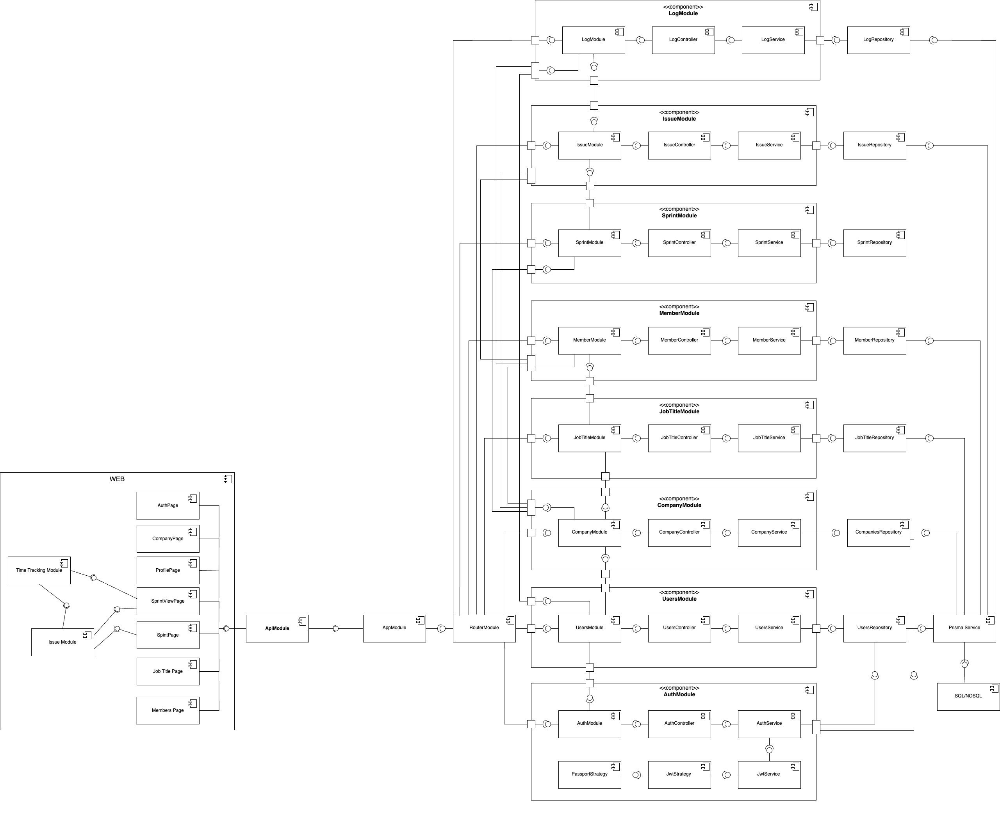

# Minira

### Учасники команди
- Кирмизи Євген ІК-24
- Фесун Анна ІМ-21
- Молебна Марія ІП-24

## Ідея проєкту
Цей проєкт — це універсальний додаток для управління проєктами, який створено для великих команд, 
щоб допомогти ефективно координувати задачі, планувати спринти та аналізувати продуктивність.
Він орієнтований на забезпечення структурованого підходу до роботи, з акцентом на прозорість, 
гнучкість і масштабованість.

### Ключові можливості та ідеї проєкту:
1. **Управління компанією та користувачами**
   - Реєстрація та автентифікація: Користувачі можуть створювати облікові записи із захищеним входом через JWT. Кожен новий користувач реєструє компанію, до якої додає інших учасників.
   - Управління учасниками:
      * Додавання нових членів команди з можливістю прив’язки до певних посад.
      * Гнучке управління правами доступу залежно від ролі (менеджер, розробник, аналітик тощо).
      * Створення та редагування профілів користувачів, включаючи їх посади та прив’язку до задач.
2. **Організація роботи через ієрархію задач**
   - Епіки, історії та завдання: Завдяки чіткій ієрархії задач кожна команда може розбивати великі цілі на менші зрозумілі етапи, що забезпечує кращий контроль.
   - Типи задач:
      * Епік: Великі цілі проєкту, що включають кілька історій.
      * Історія: Окремі функції чи частини роботи, які додають цінність.
      * Завдання: Найменша одиниця роботи.
3. **Планування та управління спринтами**
   -  Створення спринтів: Інтуїтивно зрозумілий інтерфейс для створення спринтів із визначенням дати початку, завершення та ключових цілей.
   - Моніторинг статусу: Автоматичне відображення статусу спринтів (активний, завершений, майбутній).
   - Огляд задач у спринті: Динамічна таблиця із відображенням прогресу задач, часу та відповідальних осіб.
4. **Трекінг часу та продуктивності**
   - Логування часу: Інструменти для запису витраченого та залишкового часу на кожну задачу.
   - Аналіз продуктивності:
   Автоматичні підрахунки загального часу, витраченого командою.
   Прогрес-бари для наочності виконання задач.
5. **Імпорт та інтеграція даних**
   - Імпорт задач із інших спринтів: Можливість переносити задачі між спринтами для ефективного переобліку.
6. **Управління посадами та ролями**
   - Гнучке створення посад: Розробник, аналітик, менеджер тощо.
   - Призначення посад: Спрощення розподілу ролей в команді, що забезпечує прозоре розподілення обов’язків.
7. **Інтуїтивно зрозумілий інтерфейс**
   - Навігація: Головна панель із розділами для доступу до спринтів, учасників, посад та налаштувань.
   - Глобальний пошук: Можливість швидко знаходити задачі чи учасників, навіть при великій кількості даних.
   - Візуальні індикатори: Прогрес-бари, статуси задач і різні кольори для полегшення орієнтування.
8. **Додаткові функції**
   - Налаштування компанії: Зміна назви компанії, логотипу та інших даних.
   - Особистий кабінет: Зміна особистих даних, паролів.

---

## Лабораторна робота №2 
### Налаштування проєкту та інструментів розробки

Метою даної лабораторної роботи є налаштування базового середовища розробки для проекту, включаючи пакети, 
форматтер, лінтер, Git-хуки, і перевірки на етапах коміту та пушу.

### Кроки виконання

1. **Створення пакетів**
   - Для Frontend:
    ```bash
        cd client 
        npm install 
    ```
   - Для Backend:
    ```bash
        cd server
        npm install
    ```
     
2. **Вибір стилю коду**
   - Frontend:
   Обрано досить гнучкий стиль коду, що орієнтований на проекти з React і TypeScript. 
   Основний акцент зроблено на підтримку сучасних стандартів JavaScript, чистоту коду, 
   базові перевірки для React та обмеження типу any в TypeScript.
   - Backend:
   Обрано стиль коду адаптований для проекту, орієнтованого на Node.js та TypeScript,
   із послабленими вимогами до типізації.

3. **Налаштування форматтера**

    Налаштовано конфігурацію для форматтера Prettier, що визначає правила форматування коду:
    ```bash
        {
            "singleQuote": true,
            "trailingComma": "all"
        }
    ```
   
    Ці налаштування забезпечують: 
    Єдиний стиль використання лапок (одинарні). 
    Легкість роботи з багаторядковими структурами через завершальні коми.
    
    Посилання на відповідний код: [Налаштування Prettier](https://github.com/devheniik/minira/blob/main/server/.prettierrc)

4. **Налаштування лінтера**

    - Лінтер для Server:
    Посилання на код: [Server Лінтер](https://github.com/devheniik/minira/blob/main/server/.eslintrc.js)
        * Використано ESLint з плагіном @typescript-eslint для перевірки TypeScript-коду.
        * Підключено tsconfig.json для врахування специфікацій проекту. 
        * Встановлено базові правила: відступ у 4 пробіли, вимкнено деякі обмеження для спрощення розробки (тип any, префікси інтерфейсів тощо). 
        * Налаштовано оточення для Node.js та Jest.
    - Лінтер для Client:
      Посилання на код: [Client Лінтер](https://github.com/devheniik/minira/blob/main/client/.eslintrc.cjs)
        * Використано ESLint з підтримкою React та TypeScript. 
        * Підключено плагіни @typescript-eslint, react, react-refresh. 
        * Встановлено правила для React-хуків та JSX. 
        * Визначено сучасні стандарти JS (ES2020) і відступ у 4 пробіли. 
        * Ігноруються каталоги збірки (dist) та деякі конфігураційні файли.

5. **Збірка та компіляція**

   Збірка та компіляція відбувається на https://vercel.com/ manual через деплой.

---

## Лабораторна робота №3
### Розробка структури застосунку


Зображена діаграма є діаграмою компонентів **(Component Diagram)**, що використовується в UML 
(Unified Modeling Language). Вона відображає архітектурну структуру програмного забезпечення,
зокрема взаємозв'язки між компонентами системи, модулями, сервісами, репозиторіями та іншими сутностями.

* На діаграмі представлено систему як сукупність модулів (Modules), кожен із яких відповідає за певну функціональність.
Наприклад AuthModule (Аутентифікація користувачів), IssueModule (Управління задачами), 
SprintModule (Управління спринтами), UserModule (Обробка даних користувачів), інші модулі.

* Лінії між модулями показують взаємодію між модулями. Наприклад:
AuthModule використовує дані з UserModule для аутентифікації користувачів.
SprintModule взаємодіє з IssueModule для роботи із задачами в межах спринтів.
Архітектура кожного модуля:

* Кожен модуль складається з трьох основних компонентів:

  - Controller: Обробляє запити від клієнтів (веб-додатку) і викликає необхідну логіку.
  - Service: Реалізує бізнес-логіку для виконання операцій.
  - Repository: Займається взаємодією з базою даних.

* Ліва частина діаграми відображає веб-додаток (фронтенд), де є сторінки, такі як:
AuthPage, CompanyPage, SprintPage, ProfilePage, JobTitlePage, MembersPage тощо.
Ці сторінки взаємодіють із бекенд-модулями через API.
 
* RouterModule відповідає за маршрутизацію запитів між модулями системи. 
Це забезпечує розподіл запитів до потрібного модуля в залежності від викликаного ендпоінту.

* Кожен репозиторій (Repository) пов'язаний із базою даних, що дозволяє зберігати й
отримувати дані для роботи кожного модуля.

### Основні сценарії додатку
1. **Аутентифікація користувачів**  
   * Сценарій: Користувач виконує вхід у систему (POST /auth/login).
   * Операції:
     * Агрегація: Дані користувача (email, пароль) перевіряються в базі.
     * Оновлення: Генерується новий JWT токен для сесії.

   Посилання на код: [AuthController](https://github.com/devheniik/minira/blob/main/server/src/modules/auth/auth.controller.ts)

2. **Управління компаніями**
   * Сценарії:
     * Отримання профілю компанії (GET /profile).
     * Оновлення інформації про компанію (PATCH /profile).
   * Операції:
     * Зчитування: Інформація про компанію витягується з бази за companyId.
     * Оновлення: Дані компанії оновлюються на основі UpdateCompanyDto.

    Посилання на код: [CompaniesController](https://github.com/devheniik/minira/blob/main/server/src/modules/company/companies.controller.ts)

3. **Управління завданнями**
   * Сценарії:
     * Створення завдання (POST /issue).
     * Фільтрація завдань за компанією (GET /issue).
     * Оновлення завдання (PATCH /issue/:id).
     * Видалення завдання (DELETE /issue/:id).
   * Операції:
     * Агрегація: Дані завдань фільтруються за компанією, ім'ям чи типом.
     * Оновлення: Завдання оновлюється на основі UpdateIssueDto.
     * Зміна: Створення або видалення записів завдань.

    Посилання на код: [IssueController](https://github.com/devheniik/minira/blob/main/server/src/modules/issue/issue.controller.ts)

4. **Управління посадовими позиціями**
   * Сценарії:
     * Створення посади (POST /job-title).
     * Отримання списку посад (GET /job-title).
     * Оновлення посади (PATCH /job-title/:id).
     * Видалення посади (DELETE /job-title/:id).
   * Операції:
     * Агрегація: Список посад формується на основі companyId.
     * Зміна: Створення чи видалення посади.
     * Оновлення: Зміна даних посади.
     
   Посилання на код: [JobTitleController](https://github.com/devheniik/minira/blob/main/server/src/modules/job-title/job-title.controller.ts)

5. **Логування подій**
   * Сценарій: Збереження логів подій (POST /log).
   * Операції:
     * Зміна: Новий запис події додається в базу.
     
   Посилання на код: [LogsController](https://github.com/devheniik/minira/blob/main/server/src/modules/log/logs.controller.ts)

6. **Управління членами компанії**
   * Сценарії:
     * Створення учасника компанії (POST /member).
     * Отримання списку учасників (GET /member).
     * Оновлення даних учасника (PATCH /member/:id).
     * Видалення учасника (DELETE /member/:id).
   * Операції:
     * Агрегація: Отримання даних учасників компанії.
     * Оновлення: Зміна інформації учасника.
     * Зміна: Додавання чи видалення учасника.
     
   Посилання на код: [MembersController](https://github.com/devheniik/minira/blob/main/server/src/modules/members/members.controller.ts)

7. **Управління спринтами**
   * Сценарії:
     * Створення спринта (POST /sprint).
     * Дублікація спринта (POST /sprint/duplicate/:id).
     * Отримання списку спринтів (GET /sprint).
     * Додавання чи видалення завдань у спринт (PATCH /sprint/attach-issues-to-sprint/:id).
     * Видалення спринта (DELETE /sprint/:id).
   * Операції:
     * Агрегація: Збір даних спринтів для компанії.
     * Зміна: Додавання чи видалення завдань у спринт.
     * Оновлення: Зміна характеристик спринта (назва, дедлайни тощо).
   
   Посилання на код: [SprintsController](https://github.com/devheniik/minira/blob/main/server/src/modules/sprints/sprints.controller.ts)

8. **Управління користувачами**
   * Сценарії:
     * Реєстрація нового користувача (POST /users/register).
     * Отримання профілю користувача (GET /users/profile).
     * Оновлення інформації про користувача (PATCH /users/:id).
     * Видалення користувача (DELETE /users/:id).
   * Операції:
     * Оновлення: Зміна даних користувача.
     * Зміна: Додавання нового запису (реєстрація) або видалення користувача.
     
   Посилання на код: [UsersController](https://github.com/devheniik/minira/blob/main/server/src/modules/users/users.controller.ts)

---

## Лабораторна робота №4
### Імплементація інтерактивного прототипу

### Робота з обліковими записами
1. **Сервіс аутентифікації**
    * Перевірка облікових даних: верифікація email і пароля користувача за допомогою шифрування.
    * Генерація токенів: створення JWT токенів для авторизації користувачів.
    * Підтримка безпеки: використання токенів для забезпечення захищеного доступу до ресурсів системи.
   
    Посилання на код: [AuthService](https://github.com/devheniik/minira/blob/main/server/src/modules/auth/auth.service.ts)

2. **Сервіс управління членами компанії**
    * Додавання нових співробітників: створення записів про членів компанії.
    * Отримання списку співробітників: витяг даних про членів компанії, включаючи їх посади. 
    * Оновлення інформації: редагування даних співробітників (роль, контактна інформація). 
    * Видалення співробітників: видалення запису з бази.

    Посилання на код: [MembersService](https://github.com/devheniik/minira/blob/main/server/src/modules/members/members.service.ts)

3. **Сервіс управління користувачами**
    * Реєстрація користувачів: створення нового облікового запису в системі.
    * Отримання профілю користувача: витяг інформації про користувача за його id.
    * Оновлення даних користувача: редагування профілю (ім'я, контакти, інші параметри).
    * Видалення користувача: видалення облікового запису з бази.

   Посилання на код: [UsersService](https://github.com/devheniik/minira/blob/main/server/src/modules/users/users.service.ts)

### Управління бізнес-ресурсами

4. **Сервіс управління компаніями**
    * Отримання інформації про компанію: пошук компанії за id.
    * Оновлення даних компанії: зміна інформації про компанію. 
    * Перевірка існування компанії: викидання винятків, якщо компанія не знайдена.

    Посилання на код: [CompaniesService](https://github.com/devheniik/minira/blob/main/server/src/modules/company/companies.service.ts)

5. **Сервіс управління посадовими позиціями**
    * Створення посад: додавання нової посади до бази.
    * Отримання посад компанії: пошук посад, пов’язаних із конкретною компанією.
    * Оновлення посад: редагування даних про посаду (назва, опис).
    * Видалення посад: видалення запису про посаду.

    Посилання на код: [JobTitleService](https://github.com/devheniik/minira/blob/main/server/src/modules/job-title/job-title.service.ts)

### Організація робочих процесів

6. **Сервіс управління завданнями**
    * Створення завдань: додавання нового завдання з початковими параметрами (наприклад, статус, оцінки часу). 
    * Фільтрація завдань: пошук завдань за компанією, типом чи назвою.
    * Оновлення завдань: зміна параметрів завдання (статус, час виконання тощо).
    * Видалення завдань: видалення запису про завдання з бази.

    Посилання на код: [IssueService](https://github.com/devheniik/minira/blob/main/server/src/modules/issue/issue.service.ts)

7. **Сервіс управління спринтами**
 
    * Створення спринтів: додавання нового спринта до компанії.
    * Дублікація спринтів: копіювання існуючого спринта разом із його завданнями.
    * Додавання/видалення завдань: керування списком завдань у спринті.
    * Отримання інформації про спринти: пошук спринтів компанії або конкретного спринта.
    * Видалення спринтів: видалення спринта з бази.

    Посилання на код: [SprintsService](https://github.com/devheniik/minira/blob/main/server/src/modules/sprints/sprints.service.ts)

### Моніторинг і аналіз

8. **Сервіс логування**

    * Створення логів: запис подій, пов’язаних із завданнями (витрачений час, дата).
    * Оновлення статусу завдань: автоматична зміна статусу на основі залишкового часу.
    * Агрегація даних логів: підрахунок загального витраченого часу по завданню.

    Посилання на код: [LogsService](https://github.com/devheniik/minira/blob/main/server/src/modules/log/logs.service.ts)

---

## Лабораторна робота №5
### Імплементація інтеграції з віддаленими джерелами даних

Використовується підхід Code First для визначення структури даних у коді.
Для взаємодії з базою даних використовується Prisma ORM.
Як база даних використовується PostgreSQL, що забезпечує потужність і надійність.

Файл schema.prisma описує схему бази даних, яку Prisma використовує для автоматичної 
генерації клієнтського API та управління базою даних.
Посилання на код: [schema.prisma](https://github.com/devheniik/minira/blob/main/server/prisma/schema.prisma)

Налаштування для запуску сервісу PostgreSQL у контейнері описує файл [docker-compose.yml](https://github.com/devheniik/minira/blob/main/server/docker-compose.yml)

Також створено SQL-міграції, що визначають структуру бази даних у системі. 
Посилання на код: [Migrations](https://github.com/devheniik/minira/tree/main/server/prisma/migrations)

---

## Лабораторна робота №6 
### Тестування програмного забезпечення

### 1. **UNIT-тести**
Для модуля `CompaniesService` було створено набір UNIT-тестів, що перевіряють його основні методи:
- **Метод `findOne`**:
    - Перевіряє, чи повертається компанія за її ID.
    - Перевіряє поведінку сервісу, якщо компанію з вказаним ID не знайдено.
    - Перевіряє обробку випадків, коли ID не надано.
- **Метод `update`**:
    - Перевіряє успішне оновлення інформації про компанію.
    - Імітує ситуацію, коли компанію для оновлення не знайдено.
    - Тестує виклик методу без наданого ID.

Тести виконуються із використанням моків для базового шару (`PrismaService`), щоб ізолювати код сервісу від реальної бази даних.

Посилання на код: [UNIT-тести](https://github.com/devheniik/minira/blob/main/server/src/modules/company/companies.service.spec.ts)

### 2. **Інтеграційні тести**
Інтеграційні тести перевіряють взаємодію між контролером (`CompaniesController`) і сервісом (`CompaniesService`). Основна увага приділена наступним сценаріям:
- Отримання інформації про компанію, пов’язану з авторизованим користувачем.
- Оновлення даних компанії через HTTP-запити.
- Обробка помилок, наприклад, відсутності компанії або некоректних вхідних даних.

Для імітації авторизації було налаштовано мок для `JwtAuthGuard`, який дозволяє отримувати інформацію про користувача без справжньої аутентифікації.

Посилання на код: [Інтеграційні тести](https://github.com/devheniik/minira/blob/main/server/src/modules/company/companies.controller.spec.ts)

### 3. **Е2Е (End-to-End) тести**
Е2Е тести охоплюють весь цикл роботи API. Основна мета — переконатися, що всі компоненти системи (HTTP-сервер, контролери, сервіси, база даних) працюють коректно разом. Тести включають:
- Отримання профілю компанії авторизованого користувача через запит `GET /profile`.
- Оновлення профілю компанії через запит `PATCH /profile`.
- Перевірку, що API коректно обробляє відсутність компанії або неправильні дані.

Для виконання тестів було підготовлено мокові дані та імітацію авторизації через токен.

Посилання на код: [Е2Е тести](https://github.com/devheniik/minira/blob/main/server/src/modules/company/companies.controller.spec.ts)

---

